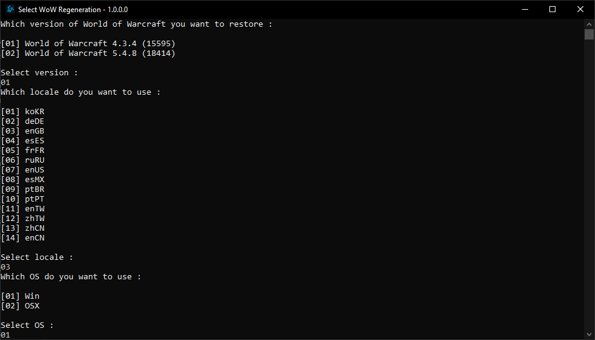

WoWRegeneration
=======================

Generic WoW /Data folder regenerator.

It will regenerate (download) /Data folder files for wow client version : 4.3.4 (15595) and 5.4.8 (18414).

How to run:
+ 1 - [Download the WoWRegeneration.exe from the Binary folder](https://github.com/CraftedRO/WoWRegeneration/raw/main/Binary/WoWRegeneration.exe).
+ 2 - Run WoWRegeneration.exe and answer the questions

Downloading can take an hour or more depending on the speed of your internet connection.

